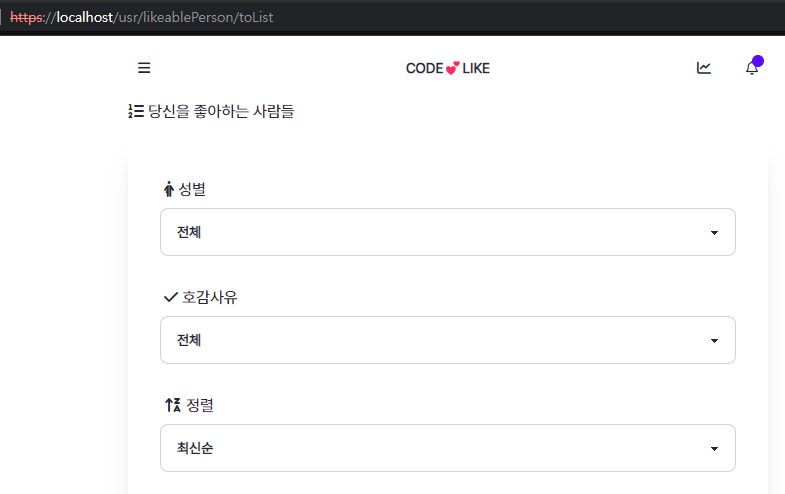
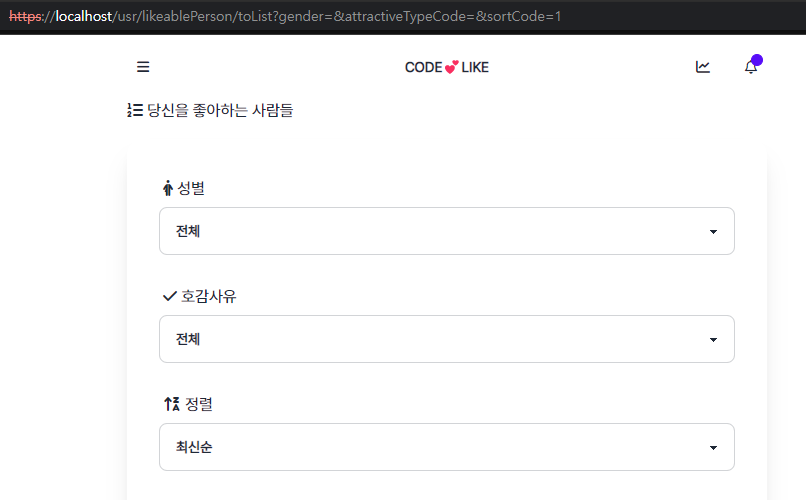
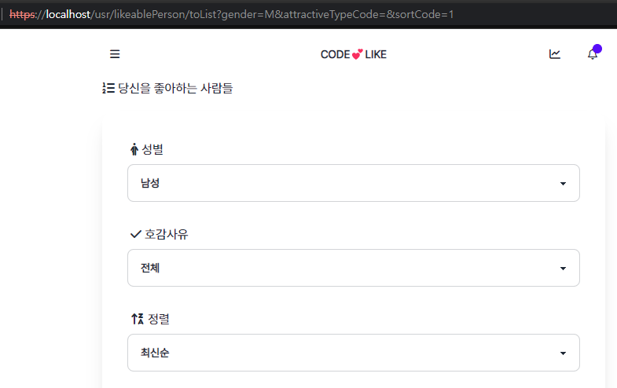
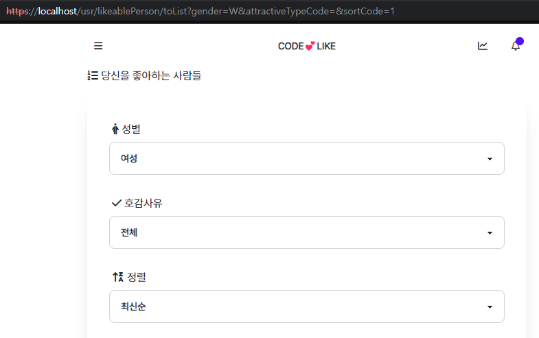

## Title: [4Week] 김도원

 

### 미션 요구사항 분석 & 체크리스트

---

#### 필수미션

- [ ] `내가 받은 호감(/usr/likeablePerson/toList)`에서 성별 필터링 기능 구현
  - [ ] `내가 받은 호감`에서 특정 성별을 가진 사람에게서 받은 호감만 필터링해서 보여주기

- [x] 네이버 클라우드 플랫폼을 통한 배포
  - [x] `https://dwk.add/` 로 접속 가능
  - [x] 카카오, 네이버, 구글, 페이스북 소셜로그인 가능
  - [x] 인스타그램 ID 연결

#### 선택미션

 

### 4주차 미션 요약

---

**[접근 방법]**

#### 필수미션

1. `내가 받은 호감(/usr/likeablePerson/toList)`에서 성별 필터링 기능 구현
- UI에서는 이 요구사항에 대한 작업이 완료되었음
- 백엔드 쪽에서 필터링 로직만 구현하였음

2. 네이버 클라우드 플랫폼을 통한 배포
- 지난 주에 배포 완료

 

#### 선택미션

 

**[특이사항]**

- 

 

**[Refactoring]**

- 