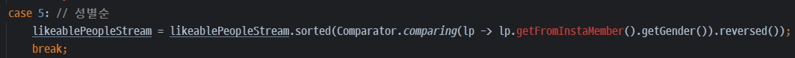

## Title: [4Week] 김도원

<br/>

### 미션 요구사항 분석 & 체크리스트

---

#### 필수미션

- [x] 1: `내가 받은 호감(/usr/likeablePerson/toList)`에서 성별 필터링 기능 구현
  - [x] `내가 받은 호감`에서 특정 성별을 가진 사람에게서 받은 호감만 필터링해서 보여주기
- [x] 2: 네이버 클라우드 플랫폼을 통한 배포 (지난 주에 완료함)
  - [x] `https://www.dwk.app/` 로 접속 가능
  - [x] 카카오, 네이버, 구글, 페이스북 소셜로그인 가능
  - [x] 인스타그램 ID 연결

#### 선택미션
- [x] 1: `내가 받은 호감(/usr/likeablePerson/toList)`에서 호감사유 필터링 기능 구현
  - [x] `내가 받은 호감`에서 특정 호감사유의 호감만 필터링해서 보여주기
- [x] 2: `내가 받은 호감(/usr/likeablePerson/toList)`에서 정렬 기능 구현
  - [x] 최신순(default): 최근에 받은 호감표시를 우선적으로 표시
  - [x] 날짜순: 오래전에 받은 호감표시를 우선적으로 표시
  - [x] 인기 많은 순: 인기가 많은 사람의 호감표시를 우선적으로 표시
  - [x] 인기 적은 순: 인기가 적은 사람의 호감표시를 우선적으로 표시
  - [x] 성별순
    - 여성 -> 남자
    - 2순위 정렬조건: 최신순
  - [x] 호감사유순
    - 외모 -> 성격 -> 능력
    - 2순위 정렬조건: 최신순
- [ ] 3: 젠킨스를 이용한 자동 배포
  - [ ] 리포지터리의 main 브랜치에 커밋 이벤트가 발생하면 자동으로 배포가 진행되도록 만들기

<br/>

### 4주차 미션 요약

---

**[접근 방법]**

#### 필수미션1
`내가 받은 호감(/usr/likeablePerson/toList)`에서 성별 필터링 기능 구현
- 강사님의 힌트를 참고하여 stream을 활용해 작성하였다.

<br/>

- `내가 받은 호감`에서 전체 성별을 조회하는 URL은 2개이다.
  - `/toList`
  - `/toList?gender=&attractiveTypeCode=&sortCode=1`

<br/>

```java
if (gender != null) {
                likeablePeopleStream = likeablePeopleStream.filter(lp -> lp.getFromInstaMember().getGender().equals(gender));
            }
```
(1) 위 코드처럼 if문의 조건을 `gender != null`로 하면,
`/toList?gender=&attractiveTypeCode=&sortCode=1`의 gender 값이 null이 아니기 때문에 오류가 발생한다.


(2) if문 조건을 `!gender.isEmpty()`로 입력하면, 해당 URL에서 전체 성별의 호감표시를 모두 볼 수 있다.

```java
if (!gender.isEmpty()) {
                likeablePeopleStream = likeablePeopleStream.filter(lp -> lp.getFromInstaMember().getGender().equals(gender));
            }
```


그러나 이 코드는 gender의 null 값 체크를 하지 않아 `/toList`로 접속할 경우에는 NullPointerException을 발생시킨다.


(3) `@RequestParam(defaultValue = "")`로 gender의 디폴트값을 empty로 설정해주면, 두 가지 URL에서 모두 잘 작동한다.

```java
public String showToList(Model model, @RequestParam(defaultValue = "") String gender, @RequestParam(defaultValue = "0") int attractiveTypeCode, @RequestParam(defaultValue = "1") int sortCode) {
        InstaMember instaMember = rq.getMember().getInstaMember();

        // 인스타인증을 했는지 체크
        if (instaMember != null) {
            // 해당 인스타회원이 좋아하는 사람들 목록
            Stream<LikeablePerson> likeablePeopleStream = instaMember.getToLikeablePeople().stream();

            if (!gender.isEmpty()) {
                likeablePeopleStream = likeablePeopleStream.filter(lp -> lp.getFromInstaMember().getGender().equals(gender));
            }
```

- 이 미션을 수행하면서 `Null/ Empty/ Blank`의 차이에 대해 다시 확실히 알고 넘어갈 수 있어서 좋았다.
- 참고자료: https://velog.io/@sixhustle/null-empty-blank


<br/>

#### 선택미션1
`내가 받은 호감(/usr/likeablePerson/toList)`에서 호감사유 필터링 기능 구현
```java
if (attractiveTypeCode != 0) {
                likeablePeopleStream = likeablePeopleStream.filter(lp -> lp.getAttractiveTypeCode() == attractiveTypeCode);
            }
```

<br/>

**[특이사항]**

#### 선택미션2

위 코드로 작성하면 `getFromInstaMember()`가 빨간색으로 표시되는 에러가 남 (원인 파악 중)

```java
// 호감을 표시한 사람의 성별을 가져오는 메서드
public String getFromInstaMemberGender() {
        return fromInstaMember.getGender();
        }
```
그래서 성별을 바로 가져오기 위해 `LikeablePerson`에 메서드를 구현하여 사용하였는데, 
에러의 원인을 파악해서 이 코드를 없애고 싶다.

<br/>

**[Refactoring]**

- 테스트케이스를 작성하지 못함
- 성별&호감사유 필터링, 정렬 기능 코드를 Controller -> Service 로 리팩토링하기

<br/>

선택미션3
- 젠킨스를 사용한 자동배포